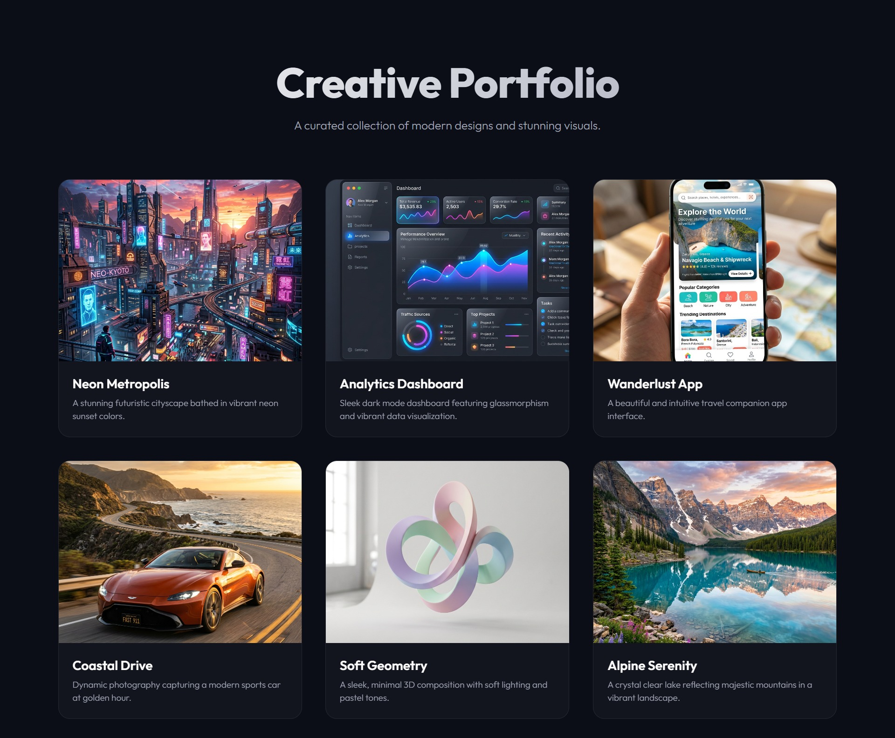

# Portfolio Gallery

**[Live Demo](https://kushalkumar-shaw.github.io/Portfolio-Gallery/)**

A modern, responsive portfolio gallery built using pure HTML and CSS (no JavaScript). This project showcases a clean and premium design aesthetic with glassmorphism, responsive grid layouts, and interactive hover animations.

## Features
- **Pure HTML & CSS**: Lightweight and fast, without any JavaScript dependencies.
- **Responsive Layout**: Uses CSS Grid to automatically adapt to desktop, tablet, and mobile screens.
- **Premium Design**: Dark mode interface with glassmorphism card effects and subtle radial gradients.
- **Micro-Animations**: Smooth hover transitions, card lifts, and image scaling for a dynamic feel.
- **Modern Typography**: Uses the 'Outfit' font from Google Fonts.

## Project Structure
- `index.html`: The main HTML structure containing the gallery layout.
- `style.css`: The stylesheet containing all design tokens, grid definitions, and animations.
- `/images`: Directory containing the high-quality portfolio images.

## Setup Instructions
1. Clone or download this repository.
2. Open the `index.html` file in any modern web browser to view the gallery. No server or build process is required!

## Technology Used
- HTML5
- CSS3
